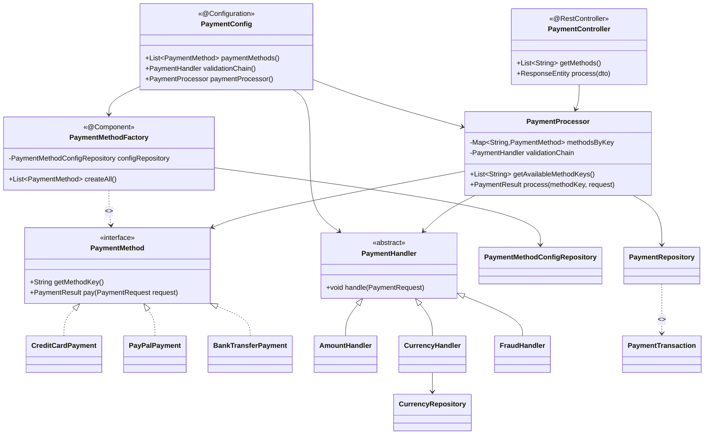
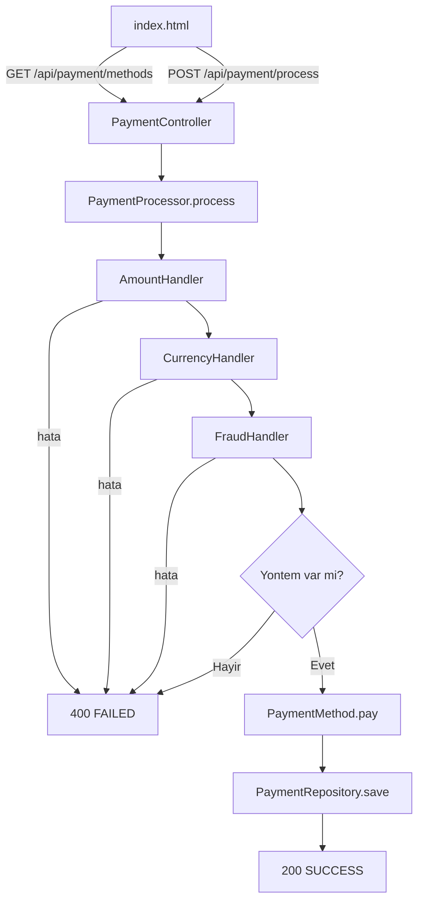

# Basit Odeme Ekrani — Spring Boot + Docker

Bu proje, bir odeme ekraninda **OOP + SOLID + Reflection + Chain of Responsibility** prensiplerini gosterir.
Spring Boot REST API olarak calisir, Docker ile containerize edilmistir.

---

## Ozellikler

- `PaymentMethod` arayuzu ile **Strategy Pattern**
- `PaymentMethodFactory` ile **Reflection tabanli dinamik nesne uretimi**
- `PaymentHandler` zinciri ile **Chain of Responsibility** dogrulama katmani
- **Spring Boot REST API** — `/api/payment/methods` ve `/api/payment/process`
- **Web formu** — `localhost:9090` adresinde acilan statik HTML form
- Combo kutusu, reflection ile yuklenen yontemleri otomatik alir (UI sync)
- Custom exception hiyerarsisi ile guvenli hata yonetimi
- **PostgreSQL entegrasyonu** — her odeme islemi `payment_transactions` tablosuna kaydedilir
- **DB tabanli konfigürasyon** — odeme yontemleri ve para birimleri DB'den yonetilir, `DataSeeder` ile ilk veri otomatik yuklenir
- **Swagger UI** — `localhost:9090/swagger-ui.html` adresinde interaktif API dokümantasyonu

---

## Mimari

### Reflection Factory

`PaymentMethodFactory`, odeme yontemlerini `new` ile olusturmak yerine **Java Reflection** kullanarak runtime'da yukler.
Yuklenecek sinif isimleri `payment_method_configs` tablosundan okunur — Java kodu degismez (OCP).
Yeni bir odeme yontemi eklemek icin sadece sinif yazilir ve DB'ye kayit eklenir.

### Chain of Responsibility

`PaymentProcessor.process()`, odeme yontemine gecmeden once inject edilen dogrulama zincirini kosutur:

```
AmountHandler → CurrencyHandler → FraudHandler → PaymentMethod.pay()
```

| Handler | Kontrol |
|---|---|
| `AmountHandler` | Tutar > 0 olmali |
| `CurrencyHandler` | Para birimi `currencies` tablosundaki degerlerden biri olmali |
| `FraudHandler` | Tutar 50.000 ustu islemleri engeller |

Zincir `PaymentConfig`'de `@Bean` olarak kurulur ve `PaymentProcessor`'a inject edilir (DIP).

---

## Paket Yapisi

```
src/main/java/payment/
├── Main.java                        # @SpringBootApplication
├── config/
│   ├── PaymentConfig.java           # @Configuration — method bean + chain bean + processor bean
│   └── OpenApiConfig.java           # @Configuration — Swagger/OpenAPI tanimlari
├── controller/
│   └── PaymentController.java       # @RestController — /api/payment/*
├── dto/
│   ├── PaymentRequestDto.java       # API istek modeli (record)
│   └── PaymentResponseDto.java      # API yanit modeli (record)
├── core/
│   └── PaymentMethod.java           # Strateji arayuzu
├── entity/
│   ├── PaymentTransaction.java      # @Entity — odeme islemi kaydi
│   ├── Currency.java                # @Entity — desteklenen para birimleri
│   └── PaymentMethodConfig.java     # @Entity — odeme yontemi sinif isimleri
├── factory/
│   └── PaymentMethodFactory.java    # @Component — reflection ile dinamik yukleme
├── methods/
│   ├── CreditCardPayment.java
│   ├── PayPalPayment.java
│   └── BankTransferPayment.java
├── model/
│   ├── PaymentRequest.java          # Immutable istek DTO (amount, currency)
│   ├── PaymentResult.java
│   └── PaymentStatus.java           # SUCCESS / FAILED
├── repository/
│   ├── PaymentRepository.java             # JpaRepository — payment_transactions
│   ├── CurrencyRepository.java            # JpaRepository — currencies
│   └── PaymentMethodConfigRepository.java # JpaRepository — payment_method_configs
├── service/
│   └── PaymentProcessor.java        # Zinciri kosturur, routing yapar, DB'ye kaydeder
├── validation/
│   ├── PaymentHandler.java          # Abstract CoR base
│   ├── AmountHandler.java
│   ├── CurrencyHandler.java
│   └── FraudHandler.java
├── seeder/
│   └── DataSeeder.java              # ApplicationRunner — currencies ve payment methods seed
└── exception/
    ├── PaymentException.java
    ├── ValidationException.java
    └── ProcessingException.java

src/main/resources/
├── application.properties           # Datasource + JPA config
└── static/
    └── index.html                   # Web form UI
```

---

## API

> Interaktif dokümantasyon: `http://localhost:9090/swagger-ui.html`
> OpenAPI JSON: `http://localhost:9090/v3/api-docs`

| Method | Endpoint | Aciklama |
|---|---|---|
| `GET` | `/api/payment/methods` | Yuklu odeme yontemlerini listeler |
| `GET` | `/api/payment/currencies` | Desteklenen para birimlerini listeler |
| `POST` | `/api/payment/process` | Odeme islemi gerceklestirir |

### GET /api/payment/methods

**Response:**
```json
["creditcard", "paypal", "banktransfer"]
```

### GET /api/payment/currencies

**Response:**
```json
["TRY", "USD", "EUR"]
```

### POST /api/payment/process

**Request:**
```json
{
  "method": "creditcard",
  "amount": 100.0,
  "currency": "TRY"
}
```

**Response (basarili):**
```json
{
  "status": "SUCCESS",
  "message": "Kredi karti ile odeme basarili."
}
```

**Response (hata):**
```json
{
  "status": "FAILED",
  "message": "Desteklenmeyen para birimi: GBP"
}
```

---

## Sinif Diyagrami (Mermaid)



---

## Akis (Mermaid)



---

## Veritabani

Her basarili odeme islemi `payment_transactions` tablosuna kaydedilir:

| Kolon | Tip | Aciklama |
|---|---|---|
| `id` | BIGSERIAL | Otomatik artan primary key |
| `method` | VARCHAR | Odeme yontemi (creditcard, paypal, banktransfer) |
| `amount` | DOUBLE | Islem tutari |
| `currency` | VARCHAR | Para birimi (TRY, USD, EUR) |
| `status` | VARCHAR | SUCCESS / FAILED |
| `message` | VARCHAR | Sonuc mesaji |
| `created_at` | TIMESTAMP | Islem zamani |

Tablolar `spring.jpa.hibernate.ddl-auto=update` ile otomatik olusturulur.

### currencies

| Kolon | Tip | Aciklama |
|---|---|---|
| `id` | BIGSERIAL | Primary key |
| `code` | VARCHAR | Para birimi kodu (TRY, USD, EUR) |

### payment_method_configs

| Kolon | Tip | Aciklama |
|---|---|---|
| `id` | BIGSERIAL | Primary key |
| `method_key` | VARCHAR | Yontem anahtari (creditcard, paypal, banktransfer) |
| `class_name` | VARCHAR | Reflection ile yuklenecek sinif adi |

Ilk veri `DataSeeder` tarafindan uygulama baslarken otomatik yuklenir (varsa atlanir).

---

## Calistirma

### Docker ile (onerilen)

```bash
docker-compose up --build
```

Uygulama `http://localhost:9090`, PostgreSQL `localhost:5432` adresinde calisir.

| Servis | Adres | Aciklama |
|---|---|---|
| payment-app | `http://localhost:9090` | REST API + Web form |
| Swagger UI | `http://localhost:9090/swagger-ui.html` | Interaktif API dokümantasyonu |
| pgAdmin | `http://localhost:5050` | PostgreSQL yonetim paneli |
| PostgreSQL | `localhost:5432` | Veritabani |

**pgAdmin baglantisi:**
1. `http://localhost:5050` adresini ac
2. Giris: `admin@admin.com` / `admin`
3. **Add New Server** → Host: `db`, Port: `5432`, Database: `paymentdb`, Username: `postgres`, Password: `postgres`

### Maven ile (yerel)

Lokalde PostgreSQL kurulu olmasi gerekir. `application.properties`'deki `db` host'unu `localhost` ile degistir, ardindan:

```bash
mvn spring-boot:run
```

Uygulama `http://localhost:8080` adresinde calisir.

---

## Gelistirme Kilavuzu

### Yeni Odeme Yontemi Eklemek

**1. Sinif yaz** — `payment/methods/` altinda `PaymentMethod` implement et:

```java
package payment.methods;

public class ApplePayPayment implements PaymentMethod {
    @Override
    public String getMethodKey() { return "applepay"; }

    @Override
    public PaymentResult pay(PaymentRequest request) throws PaymentException {
        return new PaymentResult(PaymentStatus.SUCCESS, "Apple Pay ile odeme basarili.");
    }
}
```

**2. DB'ye kayit ekle** — baska hicbir dosyaya dokunma:

```sql
INSERT INTO payment_method_configs (method_key, class_name)
VALUES ('applepay', 'payment.methods.ApplePayPayment');
```

Ya da `DataSeeder`'a satir ekle. Web formu combo kutusu otomatik guncellenir.

**Yeni para birimi eklemek icin:**

```sql
INSERT INTO currencies (code) VALUES ('GBP');
```

---

### Yeni Dogrulama Kurali Eklemek

**1. Handler yaz** — `payment/validation/` altinda `PaymentHandler` extend et:

```java
package payment.validation;

public class MaxAmountHandler extends PaymentHandler {
    @Override
    public void handle(PaymentRequest request) throws PaymentException {
        if (request.getAmount() > 10_000)
            throw new ValidationException("Tek islemde maksimum 10.000 girilebilir.");
        super.handle(request);
    }
}
```

**2. `@Component` ekle ve `PaymentConfig`'de zincire inject et** — sadece bu metodu guncelle:

```java
@Bean
public PaymentHandler validationChain(AmountHandler amountHandler, CurrencyHandler currencyHandler, FraudHandler fraudHandler, MaxAmountHandler maxAmountHandler) {
    amountHandler.setNext(currencyHandler)
                 .setNext(fraudHandler)
                 .setNext(maxAmountHandler);  // ← ekle
    return amountHandler;
}
```

`PaymentProcessor` degismez.

---

### Yeni Endpoint Eklemek

**1. Controller'a metod ekle** — `PaymentController.java`:

```java
@GetMapping("/status")
public ResponseEntity<String> status() {
    return ResponseEntity.ok("Sistem aktif");
}
```

**Yeni bir kaynak icin ayri controller yaz** (SRP):

```java
package payment.controller;

@RestController
@RequestMapping("/api/report")
public class ReportController {

    @GetMapping("/summary")
    public ResponseEntity<String> summary() {
        return ResponseEntity.ok("Rapor burada");
    }
}
```

---

### Yeni DTO Eklemek

`payment/dto/` altina yeni bir `record` yaz:

```java
package payment.dto;

public record RefundRequestDto(String transactionId, double amount) {}
```

Controller'da import edip kullan — baska degisiklik gerekmez.

---

### Yeni Exception Eklemek

`payment/exception/` altinda `PaymentException` extend et:

```java
package payment.exception;

public class InsufficientFundsException extends PaymentException {
    public InsufficientFundsException(String message) {
        super(message);
    }
}
```

Handler veya payment method icinde `throw new InsufficientFundsException(...)` ile kullan.
`PaymentController`'daki `catch (PaymentException e)` blogu otomatik yakalar.

---

## Ornek Test Girdileri

| Yontem | Tutar | Para Birimi | Beklenen |
|---|---|---|---|
| `creditcard` | `100` | `TRY` | SUCCESS |
| `paypal` | `250` | `USD` | SUCCESS |
| `banktransfer` | `500` | `TRY` | SUCCESS |
| `banktransfer` | `500` | `USD` | FAILED — yalnizca TRY |
| `creditcard` | `99999` | `TRY` | FAILED — fraud limiti |
| `paypal` | `100` | `GBP` | FAILED — desteklenmeyen para birimi |
| `creditcard` | `-50` | `TRY` | FAILED — gecersiz tutar |
