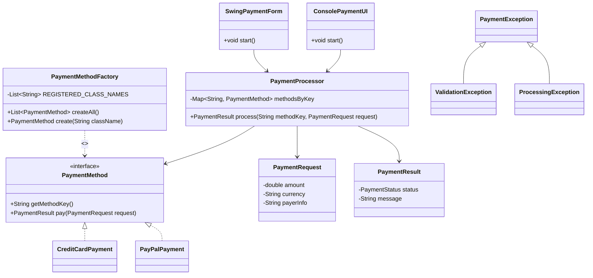
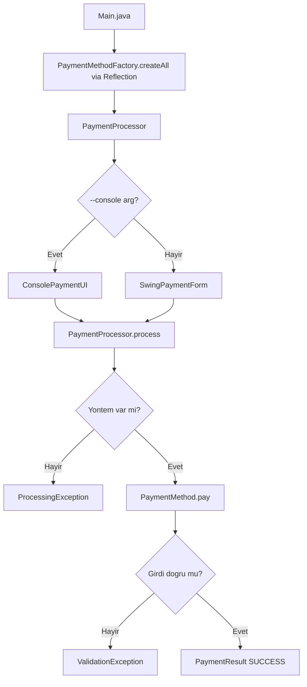

# Basit Odeme Ekrani (Java)

Bu proje, bir odeme ekraninda **OOP + SOLID + Reflection** prensiplerini gosterir.

## Ozellikler

- `PaymentMethod` arayuzu ile **Strategy Pattern**
- `PaymentMethodFactory` ile **Reflection tabanli dinamik nesne uretimi**
- `SwingPaymentForm` ile **GUI form arayuzu**
- `ConsolePaymentUI` ile **konsol arayuzu** (alternatif mod)
- Custom exception hiyerarsisi ile guvenli hata yonetimi

---

## Mimari

### Reflection Factory

`PaymentMethodFactory`, odeme yontemlerini compile-time'da `new` ile olusturmak yerine **Java Reflection** (`Class.forName` + `getDeclaredConstructor().newInstance()`) kullanarak runtime'da dinamik olarak yukler ve ornekler.

Yeni bir odeme yontemi eklemek icin:
1. `PaymentMethod` implement eden yeni sinifi yaz.
2. `PaymentMethodFactory.REGISTERED_CLASS_NAMES` listesine tam sinif adini ekle.
3. Baska hicbir sinifi degistirmene gerek yok (OCP).

### Paket Yapisi

```
src/
└── payment/
    ├── Main.java                     # Giris noktasi
    ├── core/
    │   └── PaymentMethod.java        # Strateji arayuzu
    ├── factory/
    │   └── PaymentMethodFactory.java # Reflection ile dinamik nesne uretimi
    ├── methods/
    │   ├── CreditCardPayment.java    # Kredi karti implementasyonu
    │   └── PayPalPayment.java        # PayPal implementasyonu
    ├── model/
    │   ├── PaymentRequest.java       # Immutable istek DTO
    │   ├── PaymentResult.java        # Immutable sonuc DTO
    │   └── PaymentStatus.java        # SUCCESS / FAILED enum
    ├── service/
    │   └── PaymentProcessor.java     # Orkestrasyonu yonetir
    ├── exception/
    │   ├── PaymentException.java     # Taban exception
    │   ├── ValidationException.java  # Girdi dogrulama hatalari
    │   └── ProcessingException.java  # Islem hatalari
    └── ui/
        ├── SwingPaymentForm.java     # GUI form (varsayilan)
        └── ConsolePaymentUI.java     # Konsol modu
```

---

## Sinif Diyagrami (Mermaid)



---

## Akis (Mermaid)



---

## Calistirma

### Derleme (PowerShell)

```powershell
javac -d out (Get-ChildItem -Path .\src -Filter *.java -Recurse | ForEach-Object FullName)
```

### Derleme (Linux / macOS)

```bash
find src -name "*.java" | xargs javac -d out
```

### Calistirma

```bash
# GUI modu (varsayilan)
java -cp out payment.Main

# Konsol modu
java -cp out payment.Main --console
```

---

## Ornek Test Girdileri

### Basarili Kredi Karti
- Yontem: `creditcard`
- Tutar: `100`
- Para Birimi: `TRY`
- Odeme Bilgisi: `1234567812345678`

### Basarili PayPal
- Yontem: `paypal`
- Tutar: `250`
- Para Birimi: `TRY`
- Odeme Bilgisi: `user@example.com`

### Reddedilen Kredi Karti
- Odeme Bilgisi: `0000111122223333` → `Banka islemi reddetti.`

### Engellenmis PayPal
- Odeme Bilgisi: `user@blocked.com` → `PayPal hesabi gecici olarak kullanilamiyor.`
