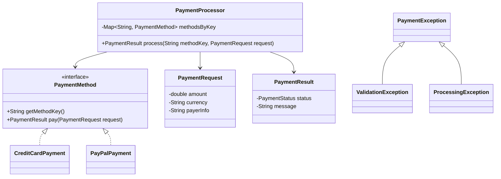
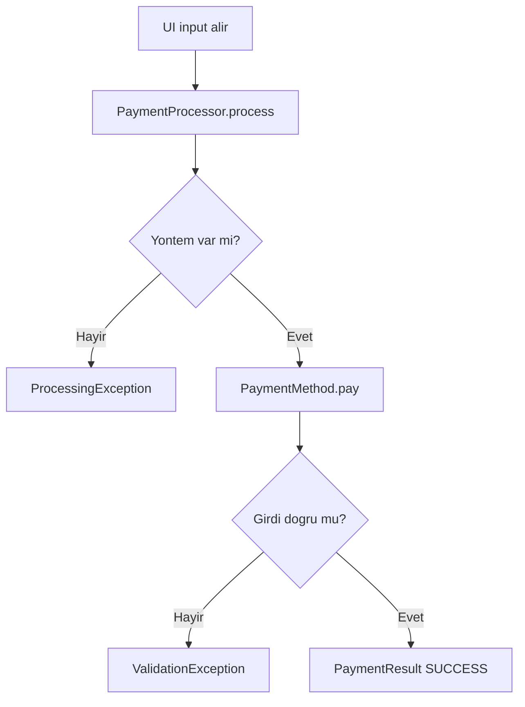

# Basit Odeme Ekrani (Java)

Bu proje, bir odeme ekraninda mevcut sisteme yeni odeme yontemi eklemeyi **OOP + abstraction + SOLID** ile basitce gosterir.

## Yaklasim

- `PaymentMethod` bir interface'tir.
- Mevcut yontem: `CreditCardPayment`
- Yeni yontem: `PayPalPayment`
- `PaymentProcessor` sadece orkestrasyon yapar (SRP).
- Yeni yontem eklemek icin mevcut siniflari degistirmeden yeni bir sinif yazmak yeterlidir (OCP).
- Hata yonetimi custom exception siniflari ile yapilir.

## Sinif Diyagrami (Mermaid)



## Akis (Mermaid)



## Calistirma

```powershell
javac -d out (Get-ChildItem -Path .\src -Filter *.java -Recurse | ForEach-Object FullName)
java -cp out payment.Main
```

## Ornek test girdileri

### Basarili kredi karti
- yontem: `creditcard`
- tutar: `100`
- para birimi: `TRY`
- odeme bilgisi: `1234567812345678`

### Basarili PayPal
- yontem: `paypal`
- tutar: `250`
- para birimi: `TRY`
- odeme bilgisi: `user@example.com`

