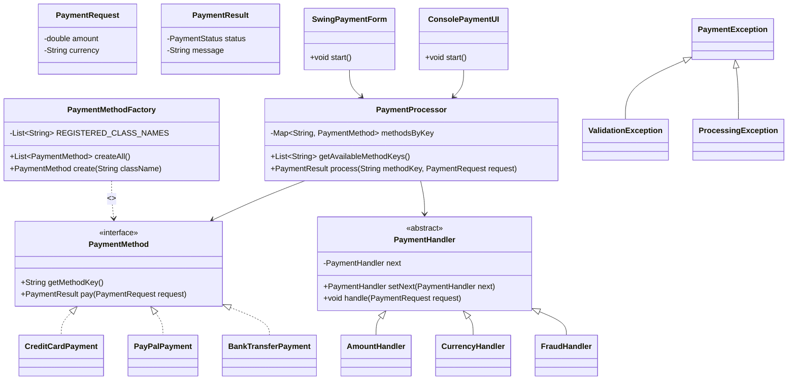
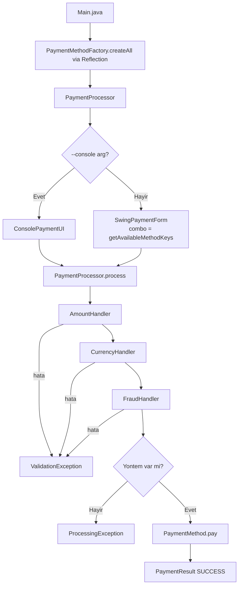

# Basit Odeme Ekrani (Java)

Bu proje, bir odeme ekraninda **OOP + SOLID + Reflection + Chain of Responsibility** prensiplerini gosterir.

## Ozellikler

- `PaymentMethod` arayuzu ile **Strategy Pattern**
- `PaymentMethodFactory` ile **Reflection tabanli dinamik nesne uretimi**
- `PaymentHandler` zinciri ile **Chain of Responsibility** dogrulama katmani
- `SwingPaymentForm` ile **GUI form arayuzu** (combo, reflection ile otomatik senkronize)
- `ConsolePaymentUI` ile **konsol arayuzu** (alternatif mod)
- Custom exception hiyerarsisi ile guvenli hata yonetimi

---

## Mimari

### Reflection Factory

`PaymentMethodFactory`, odeme yontemlerini `new` ile olusturmak yerine **Java Reflection** (`Class.forName` + `getDeclaredConstructor().newInstance()`) kullanarak runtime'da dinamik olarak yukler.

`SwingPaymentForm` combo kutusu, `PaymentProcessor.getAvailableMethodKeys()` araciligiyla yuklu yontemleri otomatik alir — UI kodu degistirmeden yeni yontem eklenir.

### Chain of Responsibility

`PaymentProcessor.process()`, odeme yontemine gecmeden once bir dogrulama zinciri kosutur:

```
AmountHandler → CurrencyHandler → FraudHandler → PaymentMethod.pay()
```

| Handler | Kontrol |
|---|---|
| `AmountHandler` | Tutar > 0 olmali |
| `CurrencyHandler` | Para birimi TRY / USD / EUR olmali |
| `FraudHandler` | Tutar 50.000 ustu islemleri engeller |

Yeni bir kural eklemek = yeni bir `PaymentHandler` sinifi yazip zincire `.setNext()` ile baglamak.

---

## Paket Yapisi

```
src/
└── payment/
    ├── Main.java                       # Giris noktasi
    ├── core/
    │   └── PaymentMethod.java          # Strateji arayuzu
    ├── factory/
    │   └── PaymentMethodFactory.java   # Reflection ile dinamik nesne uretimi
    ├── methods/
    │   ├── CreditCardPayment.java      # Kredi karti implementasyonu
    │   ├── PayPalPayment.java          # PayPal implementasyonu
    │   └── BankTransferPayment.java    # Havale/EFT implementasyonu (yalnizca TRY)
    ├── model/
    │   ├── PaymentRequest.java         # Immutable istek DTO (amount, currency)
    │   ├── PaymentResult.java          # Immutable sonuc DTO
    │   └── PaymentStatus.java          # SUCCESS / FAILED enum
    ├── service/
    │   └── PaymentProcessor.java       # Zinciri kosturur, routing yapar
    ├── validation/
    │   ├── PaymentHandler.java         # Abstract handler (CoR base)
    │   ├── AmountHandler.java          # Tutar kontrolu
    │   ├── CurrencyHandler.java        # Para birimi kontrolu
    │   └── FraudHandler.java           # Fraud kontrolu
    ├── exception/
    │   ├── PaymentException.java       # Taban exception
    │   ├── ValidationException.java    # Girdi dogrulama hatalari
    │   └── ProcessingException.java    # Islem hatalari
    └── ui/
        ├── SwingPaymentForm.java       # GUI form (varsayilan)
        └── ConsolePaymentUI.java       # Konsol modu
```

---

## Sinif Diyagrami (Mermaid)



---

## Akis (Mermaid)



---

## Yeni Odeme Yontemi Eklemek

1. `payment/methods/` altinda `PaymentMethod` implement eden sinif yaz.
2. `PaymentMethodFactory.REGISTERED_CLASS_NAMES` listesine sinif adini ekle.
3. Baska hicbir sinifi degistirmene gerek yok — UI combo otomatik guncellenir.

## Yeni Dogrulama Kurali Eklemek

1. `payment/validation/` altinda `PaymentHandler` extend eden sinif yaz.
2. `PaymentProcessor.process()` icindeki zincire `.setNext()` ile ekle.

---

## Calistirma

### Derleme (PowerShell)

```powershell
javac -d out (Get-ChildItem -Path .\src -Filter *.java -Recurse | ForEach-Object FullName)
```

### Derleme (Linux / macOS)

```bash
find src -name "*.java" | xargs javac -d out
```

### Calistirma

```bash
# GUI modu (varsayilan)
java -cp out payment.Main

# Konsol modu
java -cp out payment.Main --console
```

---

## Ornek Test Girdileri

### Basarili Kredi Karti
- Yontem: `creditcard` — Tutar: `100` — Para Birimi: `TRY`

### Basarili PayPal
- Yontem: `paypal` — Tutar: `250` — Para Birimi: `USD`

### Basarili Havale/EFT
- Yontem: `banktransfer` — Tutar: `500` — Para Birimi: `TRY`

### Desteklenmeyen Para Birimi (CurrencyHandler)
- Para Birimi: `GBP` → `Desteklenmeyen para birimi: GBP`

### Fraud Limiti Asimi (FraudHandler)
- Tutar: `99999` → `Islem fraud kontrolunden gecemedi.`

### Gecersiz Tutar (AmountHandler)
- Tutar: `-50` → `Tutar sifirdan buyuk olmalidir.`

### Havale TRY Disinda (BankTransferPayment)
- Yontem: `banktransfer` — Para Birimi: `USD` → `Havale/EFT yalnizca TRY destekler.`
