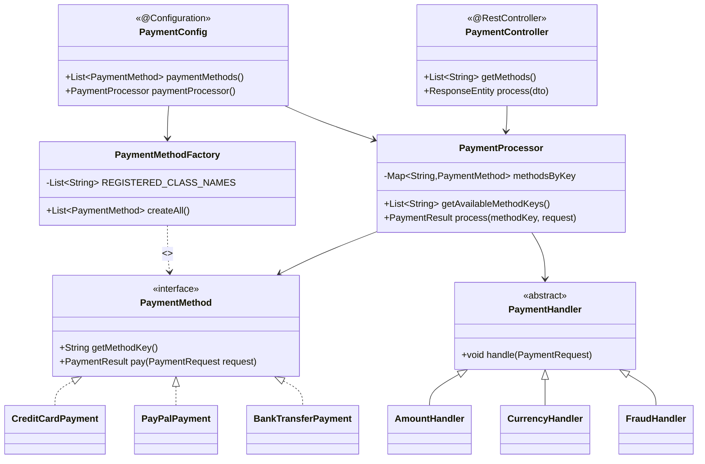
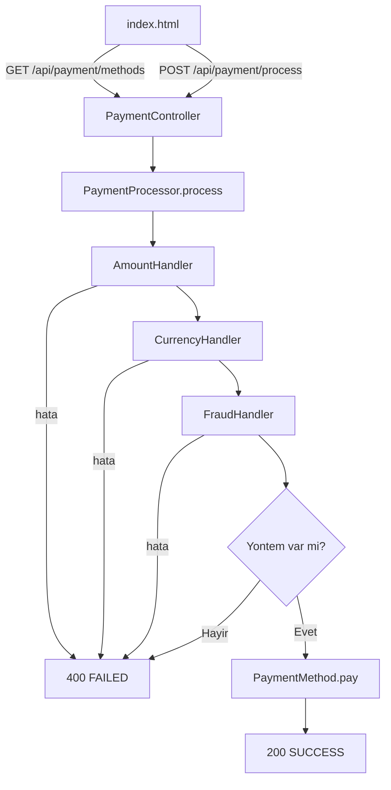

# Basit Odeme Ekrani — Spring Boot + Docker

Bu proje, bir odeme ekraninda **OOP + SOLID + Reflection + Chain of Responsibility** prensiplerini gosterir.
Spring Boot REST API olarak calisir, Docker ile containerize edilmistir.

---

## Ozellikler

- `PaymentMethod` arayuzu ile **Strategy Pattern**
- `PaymentMethodFactory` ile **Reflection tabanli dinamik nesne uretimi**
- `PaymentHandler` zinciri ile **Chain of Responsibility** dogrulama katmani
- **Spring Boot REST API** — `/api/payment/methods` ve `/api/payment/process`
- **Web formu** — `localhost:8080` adresinde acilan statik HTML form
- Combo kutusu, reflection ile yuklenen yontemleri otomatik alir (UI sync)
- Custom exception hiyerarsisi ile guvenli hata yonetimi

---

## Mimari

### Reflection Factory

`PaymentMethodFactory`, odeme yontemlerini `new` ile olusturmak yerine **Java Reflection** (`Class.forName` + `getDeclaredConstructor().newInstance()`) kullanarak runtime'da dinamik olarak yukler.

`PaymentConfig` bu listeyi `@Bean` olarak Spring context'e verir.
Web formu, `/api/payment/methods` endpoint'ini cagirarak combo kutusunu otomatik doldurur — UI kodu degistirmeden yeni yontem eklenir.

### Chain of Responsibility

`PaymentProcessor.process()`, odeme yontemine gecmeden once bir dogrulama zinciri kosutur:

```
AmountHandler → CurrencyHandler → FraudHandler → PaymentMethod.pay()
```

| Handler | Kontrol |
|---|---|
| `AmountHandler` | Tutar > 0 olmali |
| `CurrencyHandler` | Para birimi TRY / USD / EUR olmali |
| `FraudHandler` | Tutar 50.000 ustu islemleri engeller |

---

## Paket Yapisi

```
src/main/java/payment/
├── Main.java                        # Spring Boot giris noktasi (@SpringBootApplication)
├── config/
│   └── PaymentConfig.java           # @Configuration — factory + processor bean
├── controller/
│   └── PaymentController.java       # @RestController — /api/payment/*
├── core/
│   └── PaymentMethod.java           # Strateji arayuzu
├── factory/
│   └── PaymentMethodFactory.java    # Reflection ile dinamik nesne uretimi
├── methods/
│   ├── CreditCardPayment.java
│   ├── PayPalPayment.java
│   └── BankTransferPayment.java     # yalnizca TRY
├── model/
│   ├── PaymentRequest.java          # Immutable DTO (amount, currency)
│   ├── PaymentResult.java
│   └── PaymentStatus.java           # SUCCESS / FAILED
├── service/
│   └── PaymentProcessor.java        # Zinciri kosturur, routing yapar
├── validation/
│   ├── PaymentHandler.java          # Abstract CoR base
│   ├── AmountHandler.java
│   ├── CurrencyHandler.java
│   └── FraudHandler.java
└── exception/
    ├── PaymentException.java
    ├── ValidationException.java
    └── ProcessingException.java

src/main/resources/
├── application.properties
└── static/
    └── index.html                   # Web form UI
```

---

## API

| Method | Endpoint | Aciklama |
|---|---|---|
| `GET` | `/api/payment/methods` | Yuklu odeme yontemlerini listeler |
| `POST` | `/api/payment/process` | Odeme islemi gerceklestirir |

### POST /api/payment/process

**Request:**
```json
{
  "method": "creditcard",
  "amount": 100.0,
  "currency": "TRY"
}
```

**Response (basarili):**
```json
{
  "status": "SUCCESS",
  "message": "Kredi karti ile odeme basarili."
}
```

**Response (hata):**
```json
{
  "status": "FAILED",
  "message": "Desteklenmeyen para birimi: GBP"
}
```

---

## Sinif Diyagrami (Mermaid)



---

## Akis (Mermaid)



---

## Calistirma

### Docker ile (onerilen)

```bash
docker-compose up --build
```

Uygulama `http://localhost:8080` adresinde calisir.

### Maven ile (yerel)

```bash
mvn spring-boot:run
```

### Yeni Odeme Yontemi Eklemek

1. `payment/methods/` altinda `PaymentMethod` implement eden sinif yaz.
2. `PaymentMethodFactory.REGISTERED_CLASS_NAMES` listesine sinif adini ekle.
3. Baska hicbir sinifi degistirmene gerek yok.

---

## Ornek Test Girdileri

| Yontem | Tutar | Para Birimi | Beklenen |
|---|---|---|---|
| `creditcard` | `100` | `TRY` | SUCCESS |
| `paypal` | `250` | `USD` | SUCCESS |
| `banktransfer` | `500` | `TRY` | SUCCESS |
| `banktransfer` | `500` | `USD` | FAILED — yalnizca TRY |
| `creditcard` | `99999` | `TRY` | FAILED — fraud limiti |
| `paypal` | `100` | `GBP` | FAILED — desteklenmeyen para birimi |
| `creditcard` | `-50` | `TRY` | FAILED — gecersiz tutar |
